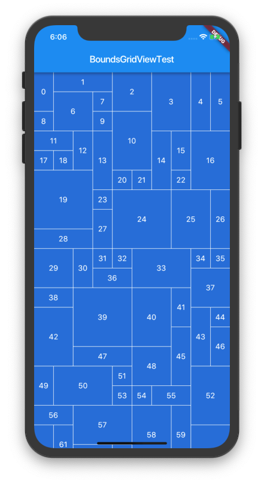

# BoundsGridView
GridViewをhtmlのcolspanやrowspanのように領域をまたげるようしたものです。



## How to use

You should create GridBoundsList object. it is used at SliverGridDelegateWithBounds constractor.
```dart
GridBoundsList list = GridBoundsList(<Widget>[
    // First Row
    GridBounds(0,0,1,1),
    GridBounds(0,1,1,1),
    GridBounds(0,2,1,1),
    GridBounds(0,3,2,2),
    
    // Second Row
    GridBounds(1,0,1,2),
    GridBounds(1,2,2,1),

    // Third Row
    GridBounds(2,0,1,2),
    GridBounds(2,3,1,2),
]);

GridView(
    gridDelegate: SliverGridDelegateWithBounds(
    boundsList: list,
    childAspectRatio: 1.0,
    mainAxisSpacing: 1.0,
    crossAxisSpacing: 1.0,
    ),
    children: <Widget>[
        ...
    ],
);
```

GridView generate layout like this.


